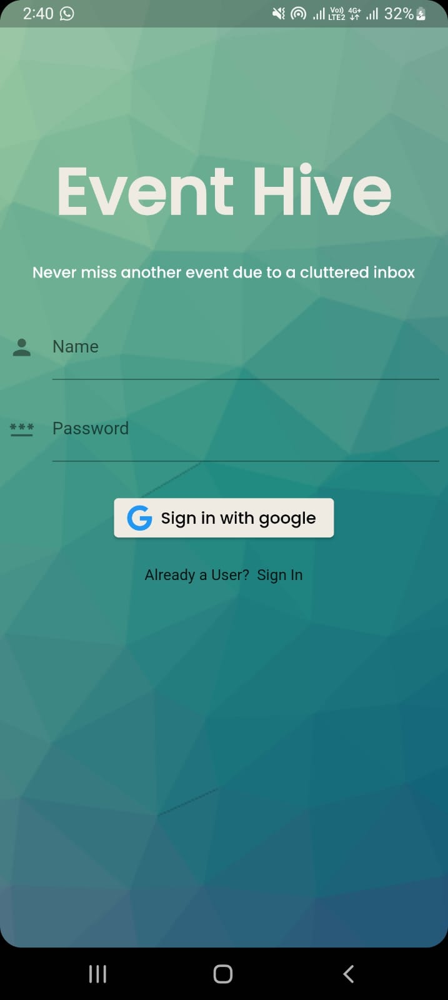
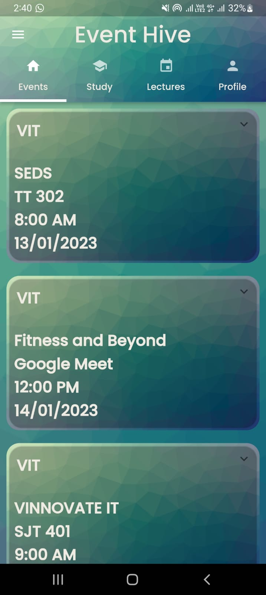
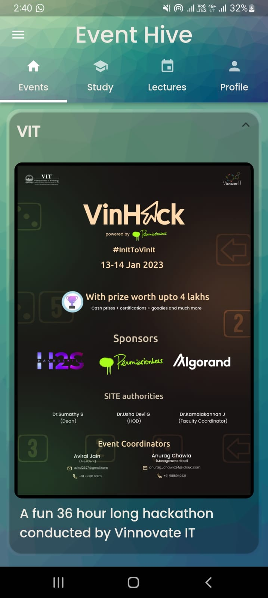
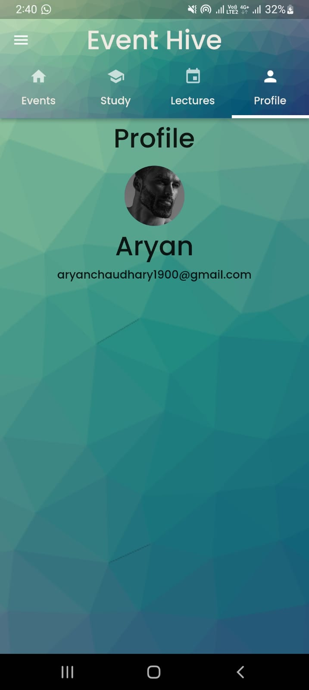

# Project for VinHack 23

Students are tired of missing out on events, Important guest lectures, and many other things due to cluttered and unorganized college emails.

Event Hive is an all-in-one platform for finding, managing, and promoting university and organization events.

[Link to Presentation](https://app.pitch.com/app/presentation/e77d2a36-8221-48f4-8ed5-7455fe700a0a/3f49b29e-f56a-4592-a265-4add7a31a609)

  <!-- Image 1 -->
  

  <!-- Image 2 -->
  

  <!-- Image 3 -->
  

  <!-- Image 4 -->
  

